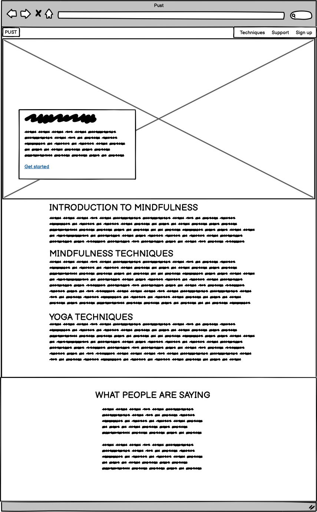
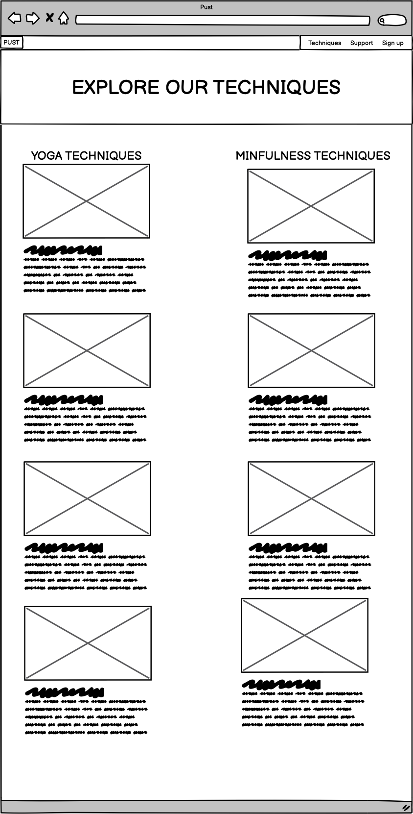
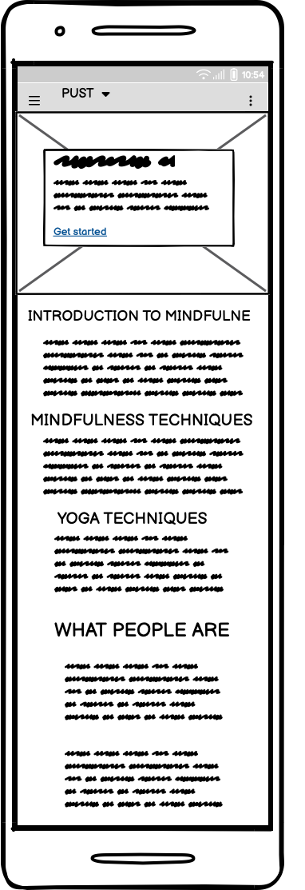
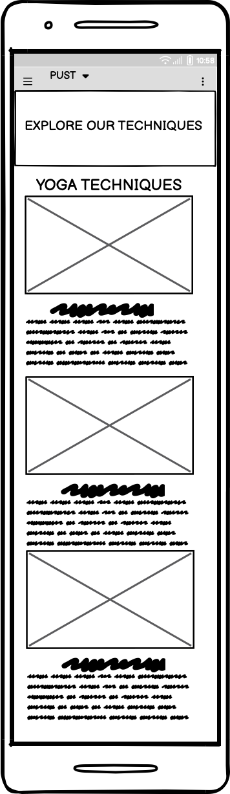
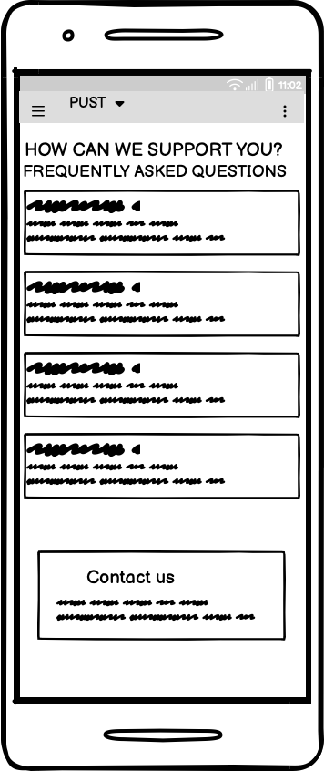
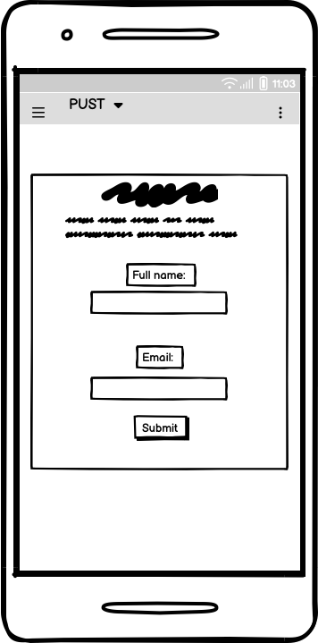

# PUST Yoga & Mindfulness Center Website

This project encompasses a welcoming website for the PUST Yoga & Mindfulness Center, offering detailed insights on yoga and mindfulness techniques, a support section for enthusiasts, and a signup page for classes. The design is mobile-responsive, ensuring a smooth user experience across various devices.

 

## Table of Contents

1. [Demo](#demo)
2. [Technologies Used](#technologies-used)
3. [File Structure](#file-structure)
4. [Setup](#setup)
5. [Features](#features)
6. [Sources](#sources)
7. [Contact](#contact)

## Demo

The live demo of the website is in progress. (You can update this section once your website is live)

## Technologies Used

- HTML
- CSS
- VS Code

## File Structures

```plaintext
project-root/
│
├── assets/
│   ├── css/
│   │   └── style.css
│   ├── images/
│       └── ... (image files)
│
├── index.html
├── techniques.html
├── support.html
├── signup.html
└── README.md
```

## Site Structure
The website is structured into four main pages:

- **Home Page**: Provides an overview of the center and its offerings.
- **Techniques Page**: Showcases various yoga and mindfulness techniques.
- **Support Page**: Lists support resources and frequently asked questions.
- **Sign-Up Page**: Features a form for interested visitors to join the center or request more information.

## Typography
The website employs the "Oxygen" and "PT Serif" fonts from Google Fonts to achieve a contemporary and refined design:

- **Font Family**: 'Oxygen', sans-serif for body text and 'PT Serif', serif for headings.
- **Font Import**: `@import url('https://fonts.googleapis.com/css2?family=Oxygen:wght@400;700&family=PT+Serif:ital@0;1&display=swap');`
- **Headings**: 'PT Serif' is utilized for headings, providing a classic serif style that contrasts with the body text.
- **Body Text**: 'Oxygen' is employed for body text, offering a modern and readable sans-serif style.

## Color Scheme
The color scheme of the project is vibrant and engaging, derived from a palette of warm and earthy tones:

- **Primary Color**: `#FFF5DC` (Beige)
- **Secondary Color**: `#FED777` (Light Goldenrod)
- **Tertiary Color**: `#FCBA12` (Selective Yellow)
- **Quaternary Color**: `#A77802` (Dark Gold)
- **Quinary Color**: `#342809` (Very Dark Brown)


### Wireframes:

The wireframes for PUST  [Balsamiq]("https://balsamiq.cloud/"). There are frames for a full width display and a small mobile device. The final site varies slightly.















Home page (index.html)

------------------------------------------------
|  Logo     | Hamburger Menu Icon (☰)         |
------------------------------------------------
| Hero Section with Image, Title, and CTA button|
|-----------------------------------------------|
| Introduction to Yoga and Mindfulness          |
|-----------------------------------------------|
| Techniques Preview                            |
|-----------------------------------------------|
| Testimonials                                  |
|-----------------------------------------------|
| Footer / Floating Action Button               |
------------------------------------------------

Tecniques page (technique.html)
------------------------------------------------
|  Logo     | Hamburger Menu Icon (☰)         |
------------------------------------------------
| Page Title: Yoga and Mindfulness Techniques  |
|-----------------------------------------------|
| Search and Filter Options                     |
|-----------------------------------------------|
| List of Techniques with images and descriptions|
|-----------------------------------------------|
| Footer / Floating Action Button               |
------------------------------------------------

Support page (support.html)
------------------------------------------------
|  Logo     | Hamburger Menu Icon (☰)         |
------------------------------------------------
| Page Title: Support                          |
|-----------------------------------------------|
| Frequently Asked Questions                    |
|-----------------------------------------------|
| Contact Form                                  |
|-----------------------------------------------|
| Footer / Floating Action Button               |
------------------------------------------------

Sign up page (signup.html)
------------------------------------------------
|  Logo     | Hamburger Menu Icon (☰)         |
------------------------------------------------
| Page Title: Sign Up                          |
|-----------------------------------------------|
| Sign Up Form (Name, Email, Password)          |
|-----------------------------------------------|
| Information on Benefits of Signing Up         |
|-----------------------------------------------|
| Footer / Floating Action Button               |
------------------------------------------------

## Features
The website incorporates several features to provide a user-friendly experience:

- **Responsive Design**: The website layout adjusts to various screen sizes, ensuring a pleasant user experience on both desktop and mobile devices.
- **Interactive Techniques Section**: The techniques section on the Techniques page presents various yoga and mindfulness exercises, each with a descriptive image and text.
- **Sign-up Form**: The Sign-up page features a form for interested visitors to join the center or request more information.
- **Accessible Navigation**: The navigation menu allows users to easily navigate through the website and find the information they need.


## Navigation Menu
The navigation menu is a crucial part of the website's user interface, allowing users to easily navigate through the site. The menu is responsive and accessible on both desktop and mobile devices. It consists of links to the following pages:

- **Home**: Returns the user to the main landing page.
- **Techniques**: Takes the user to the page showcasing different yoga and mindfulness techniques.
- **Support**: Directs the user to the support page listing resources and frequently asked questions.
- **Sign Up**: Navigates the user to the sign-up page with a form for more information.


## Web Pages

### Index Page
The main landing page introducing the center and its offerings.

### Techniques Page (`techniques.html`)
This page showcases the various yoga and mindfulness techniques offered, each accompanied by a descriptive image.

### Support Page (`support.html`)
A page listing support resources and frequently asked questions.

### Sign Up Page (`signup.html`)
A page with a form for interested visitors to sign up for more information.

## CSS Styles
The styling for the website is contained in the `style.css` file located in the `assets/css/` directory. The CSS code defines a color scheme, typography, layout, and responsive design settings to ensure the website is accessible across a variety of devices.
