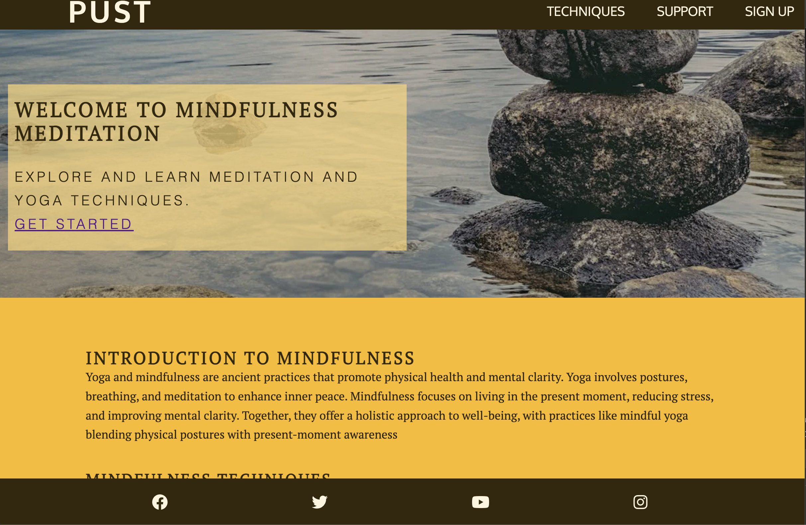
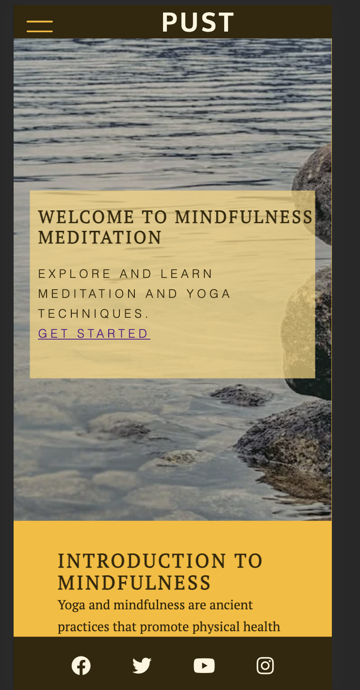

# PUST Yoga & Mindfulness Center Website

This project encompasses a welcoming website for the PUST Yoga & Mindfulness Center, offering detailed insights on yoga and mindfulness techniques, a support section for enthusiasts, and a signup page for classes. The design is mobile-responsive, ensuring a smooth user experience across various devices.

 

 

## Table of Contents

1. [Demo](#demo)
2. [Technologies Used](#technologies-used)
3. [File Structure](#file-structure)
4. [Setup](#setup)
5. [Features](#features)
6. [Sources](#sources)
7. [Contact](#contact)

## Demo

The live demo of the website is in progress. https://thebluewolfofthenorth.github.io/yoga-mindfullnes-app/

## Technologies Used

- HTML
- CSS
- VS Code

## File Structures

```plaintext
project-root/
│
├── assets/
│   ├── css/
│   │   └── style.css
│   ├── images/
│       └── ... (image files)
        └── ... (testing files)
│
├── index.html
├── techniques.html
├── support.html
├── signup.html
└── README.mdgi
└── TESTING.mdgi
```

## Site Structure
The website is structured into four main pages:

- **Home Page**: Provides an overview of the center and its offerings.
- **Techniques Page**: Showcases various yoga and mindfulness techniques.
- **Support Page**: Lists support resources and frequently asked questions.
- **Sign-Up Page**: Features a form for interested visitors to join the center or request more information.
- **Cofirmation pager**: Features a confirmation after submiting the sign-up form.

## Typography
The website employs the "Oxygen" and "PT Serif" fonts from Google Fonts to achieve a contemporary and refined design:

- **Font Family**: 'Oxygen', sans-serif for body text and 'PT Serif', serif for headings.
- **Font Import**: `@import url('https://fonts.googleapis.com/css2?family=Oxygen:wght@400;700&family=PT+Serif:ital@0;1&display=swap');`
- **Headings**: 'PT Serif' is utilized for headings, providing a classic serif style that contrasts with the body text.
- **Body Text**: 'Oxygen' is employed for body text, offering a modern and readable sans-serif style.

## Color Scheme
The color scheme of the project is vibrant and engaging, derived from a palette of warm and earthy tones:

- **Primary Color**: `#FFF5DC` (Beige)
- **Secondary Color**: `#FED777` (Light Goldenrod)
- **Tertiary Color**: `#FCBA12` (Selective Yellow)
- **Quaternary Color**: `#A77802` (Dark Gold)
- **Quinary Color**: `#342809` (Very Dark Brown)


### Wireframes:

The wireframes for PUST  [Balsamiq]("https://balsamiq.cloud/"). There are frames for a full width display and a small mobile device. The final site varies slightly.


Home page (index.html)

------------------------------------------------
|  Logo     | Hamburger Menu Icon (☰)         |
------------------------------------------------
| Hero Section with Image, Title, and CTA button|
|-----------------------------------------------|
| Introduction to Yoga and Mindfulness          |
|-----------------------------------------------|
| Techniques Preview                            |
|-----------------------------------------------|
| Testimonials                                  |
|-----------------------------------------------|
| Footer / Floating Action Button               |
------------------------------------------------

Tecniques page (technique.html)
------------------------------------------------
|  Logo     | Hamburger Menu Icon (☰)         |
------------------------------------------------
| Page Title: Yoga and Mindfulness Techniques  |
|-----------------------------------------------|
| Search and Filter Options                     |
|-----------------------------------------------|
| List of Techniques with images and descriptions|
|-----------------------------------------------|
| Footer / Floating Action Button               |
------------------------------------------------

Support page (support.html)
------------------------------------------------
|  Logo     | Hamburger Menu Icon (☰)         |
------------------------------------------------
| Page Title: Support                          |
|-----------------------------------------------|
| Frequently Asked Questions                    |
|-----------------------------------------------|
| Contact Form                                  |
|-----------------------------------------------|
| Footer / Floating Action Button               |
------------------------------------------------

Sign up page (signup.html)
------------------------------------------------
|  Logo     | Hamburger Menu Icon (☰)         |
------------------------------------------------
| Page Title: Sign Up                          |
|-----------------------------------------------|
| Sign Up Form (Name, Email, Password)          |
|-----------------------------------------------|
| Information on Benefits of Signing Up         |
|-----------------------------------------------|
| Footer / Floating Action Button               |
------------------------------------------------

## Features
The website incorporates several features to provide a user-friendly experience:

- **Responsive Design**: The website layout adjusts to various screen sizes, ensuring a pleasant user experience on both desktop and mobile devices.
- **Interactive Techniques Section**: The techniques section on the Techniques page presents various yoga and mindfulness exercises, each with a descriptive image and text.
- **Sign-up Form**: The Sign-up page features a form for interested visitors to join the center or request more information.
- **Accessible Navigation**: The navigation menu allows users to easily navigate through the website and find the information they need.


## Navigation Menu
The navigation menu is a crucial part of the website's user interface, allowing users to easily navigate through the site. The menu is responsive and accessible on both desktop and mobile devices. It consists of links to the following pages:

- **Home**: Returns the user to the main landing page.
- **Techniques**: Takes the user to the page showcasing different yoga and mindfulness techniques.
- **Support**: Directs the user to the support page listing resources and frequently asked questions.
- **Sign Up**: Navigates the user to the sign-up page with a form for more information.


## Web Pages

### Index Page
The main landing page introducing the center and its offerings.

### Techniques Page (`techniques.html`)
This page showcases the various yoga and mindfulness techniques offered, each accompanied by a descriptive image.

### Support Page (`support.html`)
A page listing support resources and frequently asked questions.

### Sign Up Page (`signup.html`)
A page with a form for interested visitors to sign up for more information.

### Confirmation Page (`signup.html`)
A page with confirmation for the submit form.

## CSS Styles
The styling for the website is contained in the `style.css` file located in the `assets/css/` directory. The CSS code defines a color scheme, typography, layout, and responsive design settings to ensure the website is accessible across a variety of devices.

## Technologies Used

- [HTML5](#html5): provides the content and structure for the website

- [CSS](#css): provide the styling

- [Balssamiq](#balsamiq): used to create the wireframes

- [VS Code](vs-code): used to deploy the website.

## Testing

Please refer to <a href="https://github.com/thebluewolfofthenorth/yoga-mindfullnes-app"><em>here<em></a> for more information on testing PUST-Yoga-and-mindfullnes

## Deployment 

This site was depolyed to GitHub pages. The steps to deploy a site are shown below:

1. In the GitHub Repository called <b>yoga-mindfullnes-app</b> click on the <b>Settings</b> button on the Repoitory navigation menu.

2. In <b>Settings</b> on the left side, go down to the <b>Pages</b> item and click on it.

3. Make sure the <b>Source</b> item is set to: <b>Deploy from a branch</b>

4. at the <b>Branch</b> item underneth the <b>source</b> item, set the branch to main and save it.

5. Once you have selected the main branch, the page will automatically refresh to show a detailed ribbon display indicating that the deployment was successful.

To get to the live link of the GitHub repository - click here: <a href="https://thebluewolfofthenorth.github.io/yoga-mindfullnes-app/">https://thebluewolfofthenorth.github.io/yoga-mindfullnes-app/</a>


#### To create a local clone of this project:

1. Click the Code tab under the repository's name.
2. Click the clipboard icon in the Clone with HTTPS section to copy the URL.


Once you have copied the URL, you can use a Git client to clone the repository to your local computer.
Here are the steps to clone a repository using Git Bash:

3. Open Git Bash.
4. Navigate to the directory where you want to clone the repository.
5. Type the following command and press Enter:

git clone <URL>

Replace <URL> with the URL of the repository that you copied in step 2.

This will create a local clone of the repository in the current directory.

You also can create and name the directory where the clone should be saved in, with adding the directory name after the <URL>. So the full command would look like this: git clone <URl> XXXX(This is a directory name)

## Credits

  ## Content
- Yoga and Mindfulness Techniques: 
   - Content for the Techniques page was inspired by [Yoga Journal](https://www.yogajournal.com/) and [Mindful](https://www.mindful.org/).
   - [Introduction to Yoga - Harvard Health](https://www.health.harvard.edu/exercise-and-fitness/introduction-to-yoga-copy#:~:text=,health%20on%20many%20different%20levels): Provided insights into the health benefits of yoga on different levels.
   - [Mindfulness Exercises - Mayo Clinic](https://www.mayoclinic.org/healthy-lifestyle/consumer-health/in-depth/mindfulness-exercises/art-20046356#:~:text=Mindfulness%20is%20a%20type%20of,mind%20and%20help%20reduce%20stress): Offered a type of mental training to refocus the mind and help reduce stress.
   - [An Introduction to Mindfulness - Oxygen Yoga and Fitness](https://oxygenyogaandfitness.com/an-introduction-to-mindfulness/#:~:text=In%20furtherance%20of%20incorporating%20mindfulness,focus%20of%20your%20yoga%20practice): Discussed the incorporation of mindfulness into the focus of yoga practice.
   - [An Introduction to Mindfulness through Yoga, Tai Chi, and Meditation - CG Scholar](https://www.cgscholar.com/bookstore/works/an-introduction-to-mindfulness-through-yoga-tai-chi-and-meditation#:~:text=Though%20being%20mindful%20in%20the,yoga%2C%20tai%20chi%2C%20and%20meditation): Explored being mindful through yoga, tai chi, and meditation.
   - [Common Yoga Poses - Greatist](https://greatist.com/move/common-yoga-poses#:~:text=,away%20from%20your%20ears%2C%20draw)
   - [Yoga Poses for Beginners - Yoga Basics](https://www.yogabasics.com/practice/yoga-for-beginners/yoga-poses-beginners/#:~:text=,pose%20and%20cow%20pose)
   - [Common Yoga Breathing Techniques - health.gov.capital](https://health.gov.capital/what-are-some-common-yoga-breathing-techniques/#:~:text=Here%20are%20some%20common%20yoga,the%20back%20of%20the%20throat)
   - [Types of Yoga Breath - My Yoga Teacher](https://www.myyogateacher.com/articles/types-of-yoga-breath#)
- Breathing Exercises: Information about breathing exercises was gathered from [Breathworks](https://www.breathworks-mindfulness.org.uk/).
- Mindfulness Exercises:
   - [Simple Ways to Practice Mindfulness - Mayo Clinic](https://www.mayoclinic.org/healthy-lifestyle/consumer-health/in-depth/mindfulness-exercises/art-20046356#:~:text=There%20are%20many%20simple%20ways,sound%2C%20sight%2C%20smell%20and%20taste)
   - [Mindfulness Techniques for Depression, Anger - Positive Psychology](https://positivepsychology.com/mindfulness-exercises-techniques-activities/#:~:text=Mindfulness%20Techniques%20for%20Depression%2C%20Anger%2C,has%20shown%20some%20promising%20results)
   - [Best Mindfulness Exercises - Self](https://www.self.com/story/best-mindfulness-exercises#:~:text=Anxiety,Reviewed%20by%20Sabrina)
   - [Mindfulness Activities - Healthline](https://www.healthline.com/health/mind-body/mindfulness-activities#:~:text=One%20of%20the%20most%20common,These%20exercises%20are)


- The yoga and mindfulness techniques described in this project were inspired by [Source Name](source URL).
- Imagery sourced from [Source Name](source URL).


   ### Media:

   - background image on Home page came from <a href="https://www.pexels.com/">pexels</a>

   - images on other pages came from <a href="https://www.pexels.com/">unspash</a> and <a href="https://www.istockphoto.com">istockphoto</a>

   ### Code: 

   The Navigation Menu was build with a <a href="https://www.youtube.com/watch?v=8QKOaTYvYUA">YouTube tutorial</a> and the code is based on this video. 
   To see the code click <a href="https://github.com/thebluewolfofthenorth/yoga-mindfullnes-app/blob/main/assets/css/style.css">here</a>

   The  page was build, while using the "Love Running" project as Guideline.
   To see the code click <a href="https://github.com/thebluewolfofthenorth/yoga-mindfullnes-app/blob/main/assets/css/style.css">here</a>

      The  page was build, while using the "Sofing" project as Guideline.
   To see the code click <a href="https://github.com/thebluewolfofthenorth/yoga-mindfullnes-app/blob/main/assets/css/style.css">here</a>

   ## Acknowledgements:

   thanks to my mentor Ronan to help me along to the completion of this project


## note:

I had quite a lot of problem that I did not know how to fix and the time was running out from. I also have to say that I use a lot of code from different sources but made my own andI was pretty unsure on how to credit them. please note that README file I copy the structure form of other readme files found on github.  