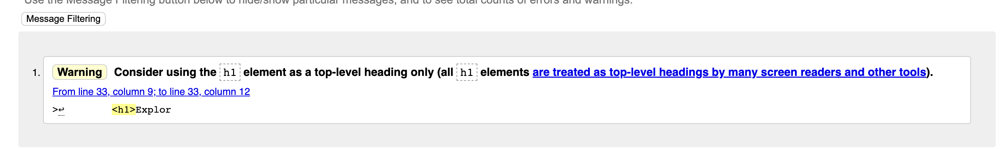
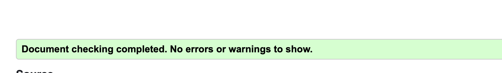
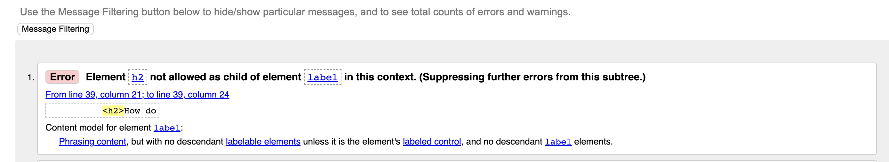
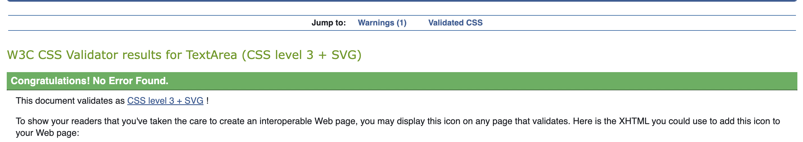
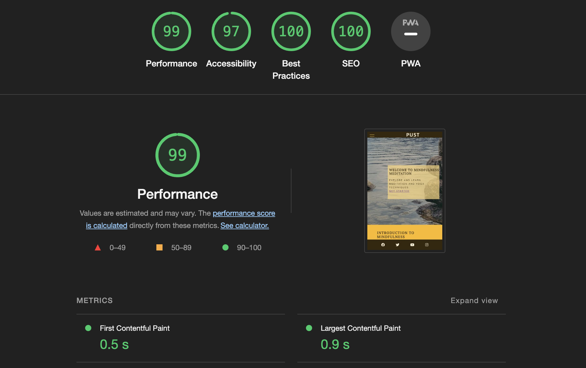
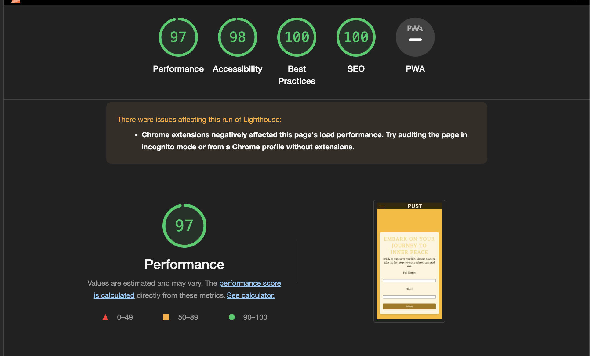

# Testing

## Code Validation

- Pust yoga and mindfulness website has been thoroughly tested. All of the code has been run through the W3C HTML Validator and the W3C CSS Validator. errors were found on the home, support, and technique, as well as a warning.

Some of the errors have been fixed, except for the warning on. mostly because of the lack of time and not knowing how to fix them. 

The HTML validator results for each page are below:

 - Technique:

 

 - Home:

 

 - Support:

 

 - Sign up:

 

 - Confirmation: 

 

 - CSS stylesheet - CSS Validator result:

 

 ## Responsivness Test
 The responsive design tests were carried out manually with <a href="https://developer.chrome.com/docs/devtools/">Google Chrome DevTools</a> and <a href="https://www.responsivedesignchecker.com/">Responsive Design Checker</a> and <a href="https://www.mozilla.org/en-US/firefox/developer/">Firefox DevTools</a>

 The site passed all Test on the <a href="https://www.responsivedesignchecker.com/">Responsive Design Checker.</a>
 

 ### Lighthouse

 The site was also tested using <a href="https://developer.chrome.com/docs/lighthouse/overview/#devtools">Lighthouse</a> in Chrome Developer Tools to test each of the pages for: 

  - Performance - How the page performs whilst
  loading.
  - Accessibility - Is the site acccessible for all users and how can it be improved
  - Best Practices - Site conforms to industry
  best practices.
  - SEO - Search engine optimisation. Is the site optimised for search engine result rankings.

The Screenshot below show the result for Desktops: 

The Screenshot below show the result for small devices like mobiles:

[def]: code-validatio